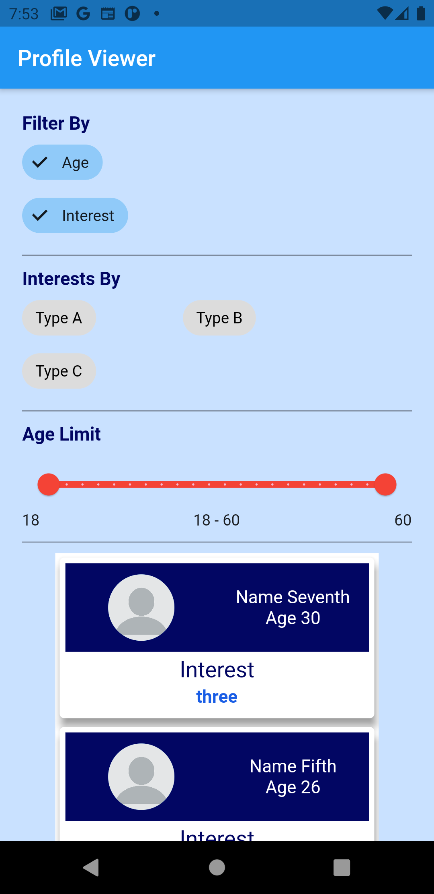
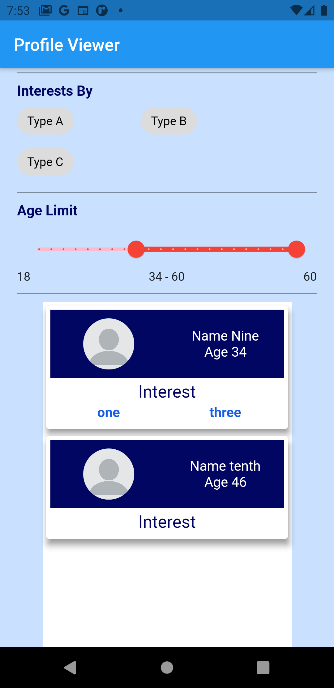
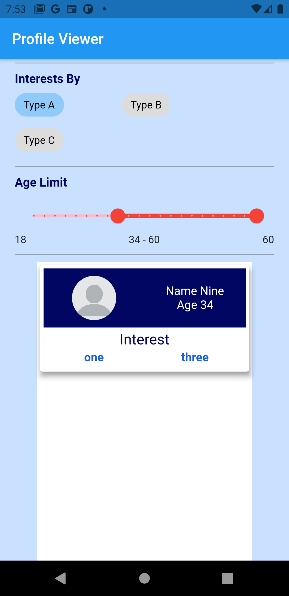

# Profile Viewer

## Getting Started

This project is for learning purpose only.

### Installation
Install few library specified in pubspec.yaml

cupertino_icons: ^1.0.2
provider: ^5.0.0
flutter_form_builder: ^6.0.1
firebase_core: ^1.3.0
cloud_firestore: ^2.2.2
lazy_load_scrollview: 1.3.0

By using pub get
  
then run main.dart file for android physical device or emulator
  
Here are Some Screen Shots of this Project

</img>

Filters

</img>

Filter Results

    </img></img>

FIrebase (Firestore) is used for database
